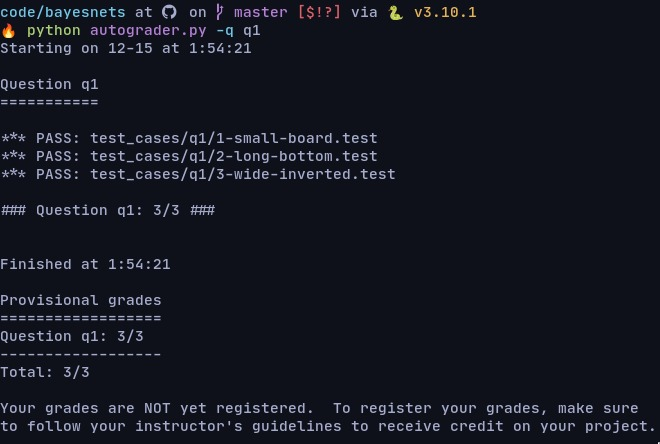
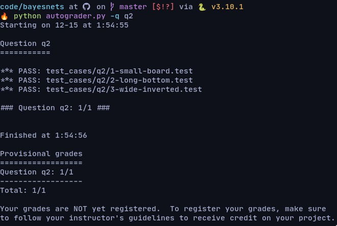
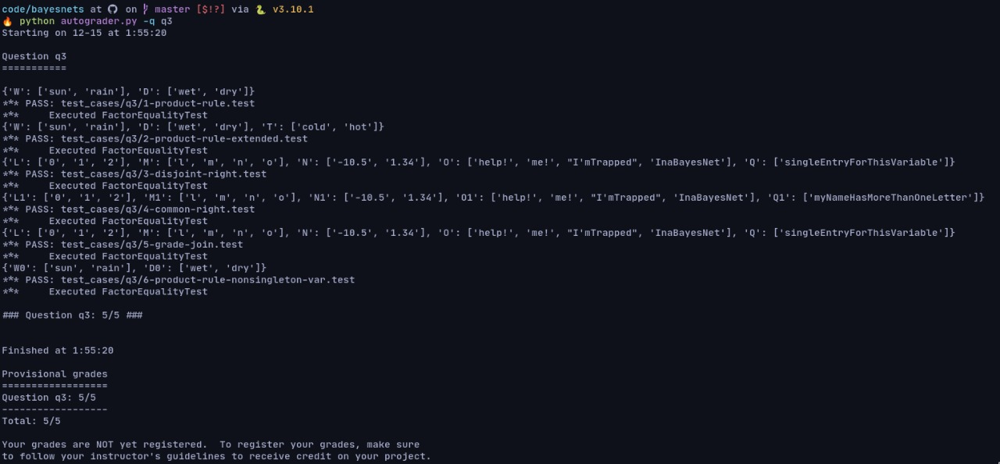
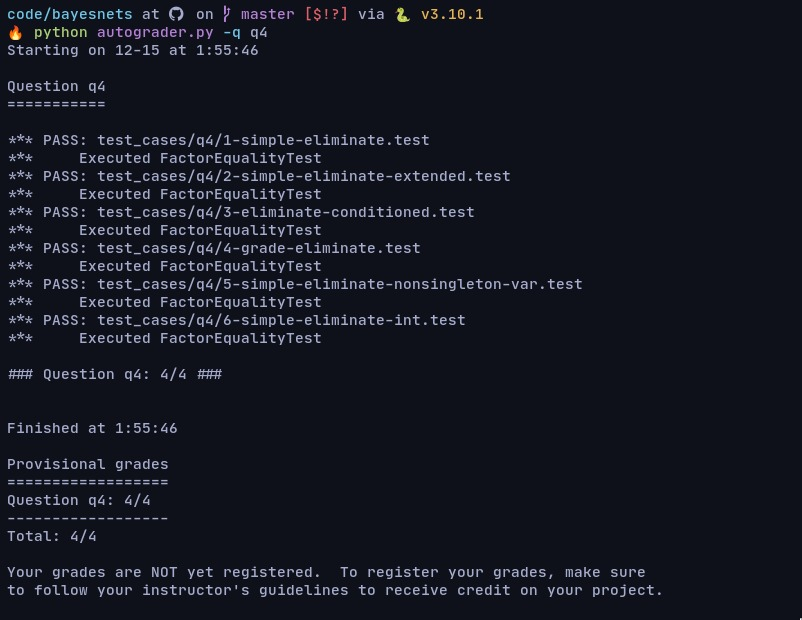
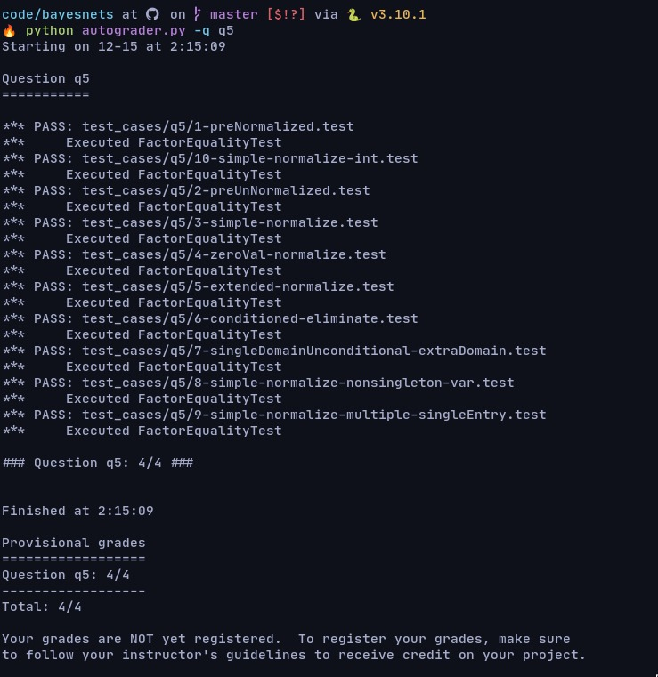

# Project 4: Inference in Bayes Nets

There's 8 problem needed to be solved, This problem include,

* [x] Q1 Bayes Net Structure
* [x] Q2 Bayes Net Probabilities
* [x] Q3 Join Factors
* [x] Q4 Eliminate
* [x] Q5 Normalize
* [ ] Q6 Variable Elimination
* [ ] Q7 Marginal Inference
* [ ] Q8 Value of Perfect Information

## Q1 Bayes Net Structure

> Difficulty: Medium(4.5/10)

In this problem, i needed to make a function that can construct an empty bayes
net using gamestate as an input. As explained in the website the bayes net will
have a X position, Y position which X positions determine which house goes on
which side of the board. It is either food-left or ghost-lef, and Y positions
determine how the houses are vertically oriented. A Food house and a ghost house
specify the actual positions of the two house and The observations are
measurements that Pacman makes while traveling around the board.

first populate the observation variable using this function,

```python
for housePos in gameState.getPossibleHouses():
    for obsPos in gameState.getHouseWalls(housePos):
        obsVar = OBS_VAR_TEMPLATE % obsPos
        obsVars.append(obsVar)
```

Then we neeeded to populate edges list for each position variables in the xPos
and yPos to the housPos and housePos to the observation Position. Then we set variables
domains dictionary for each variables (xVar, yVar, housVar, and obsVar) with it's
corresponding value. In the end function return bayes net which constructed using
constructBayes function and return it's value



## Q2

> Difficulty: Medium(4.0/10)

This function implement bayesNet that already been made in previous function and
specify the factors governing the Y position variables(the Xpos, house and obs
already been filled). The left thing to do is to complete the function for all
yPos element available

```python
yFactor.setProbability({Y_POS_VAR: BOTH_TOP_VAL}, PROB_BOTH_TOP)
yFactor.setProbability({Y_POS_VAR: BOTH_BOTTOM_VAL}, PROB_BOTH_BOTTOM)
yFactor.setProbability({Y_POS_VAR: LEFT_TOP_VAL}, PROB_ONLY_LEFT_TOP)
yFactor.setProbability({Y_POS_VAR: LEFT_BOTTOM_VAL}, PROB_ONLY_LEFT_BOTTOM)
```



## Q3

> Difficulty: Hard(7.5/10)

This function implment the functionality to joins the two factors. JoinFactor can
be used as the product rule, for example, if we have a factor of the form
P(X|Y) and another factor of the form P(Y), then joining these factors will yield
P(X,Y). This allowed us to incorporate probabilities for conditioned variables
(in this case, Y).

First we need to make uncoditional variable and conditional variable list to store
both of the from the factor. If the unconditional variable were none The unconditional
variable were ignored. Then the function chechk if there is a unconditional
variable in nthe conditional variable it will moved that variable to the
unconditional variable. After that we make new factor with name fact. After that
for each assignment Dictionary key we make a new dictionary key and the old key we
set into 1 and the final factor were old dict key times new key.



## Q4

> Difficulty: Hard(8.0/10)

In Q4 essentialy we use the same logic as Q3, In this function we need to delete
one key variable based on the parameter, ex P(X,Y|Z), Y) = P(X|Z).

The key difference here is for each assignment dictionary if the dictionary keys
is the same with elimination and elimination variable were in unconditional variable
it will delete the elimination variable. After it was deleted the remaining keys
were counted again the probabilities and summed and returned



## Q5

> Difficulty: Hard(9.0/10)

In this function we need to check for each dictionary if the uncodition value is
one or not. if the uncondition value is more than one we need to remove that value.
after that we need to to make evidence dictionary to contain variable with one domain
or value. Then for each assignment dictionary we check if the value of dictionary
were not part of evidence we skipped it(flag = 0) and if it is were part of it
(flag=1) we put it's factor into overall probability(alpha) and if alpha is zero
we return none and if it isnt we make sum alpha divided from previous alpha.
Finally we set the fihal probability with alpha and dictionary probability


