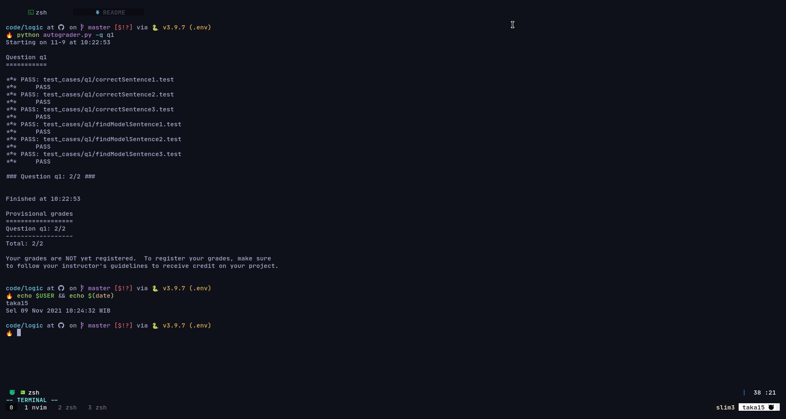
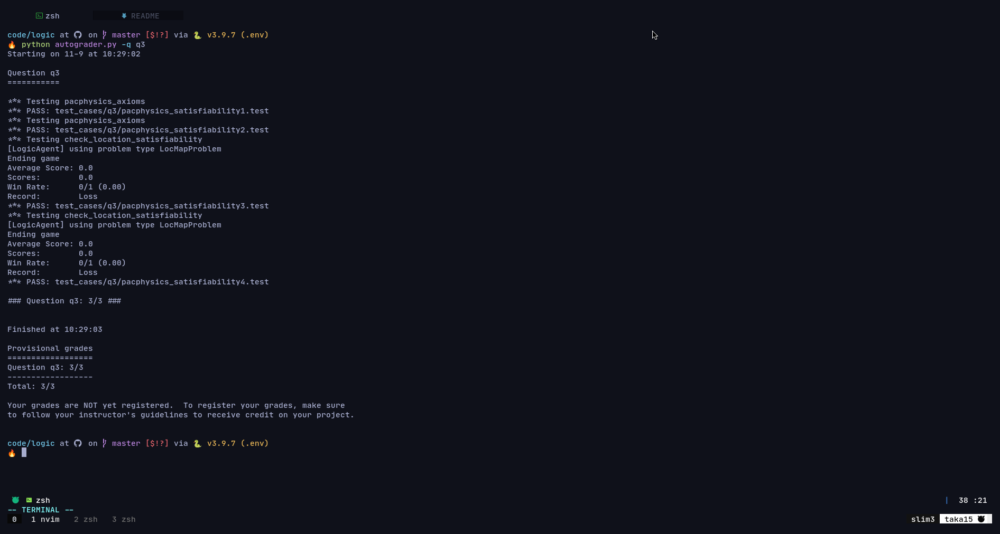
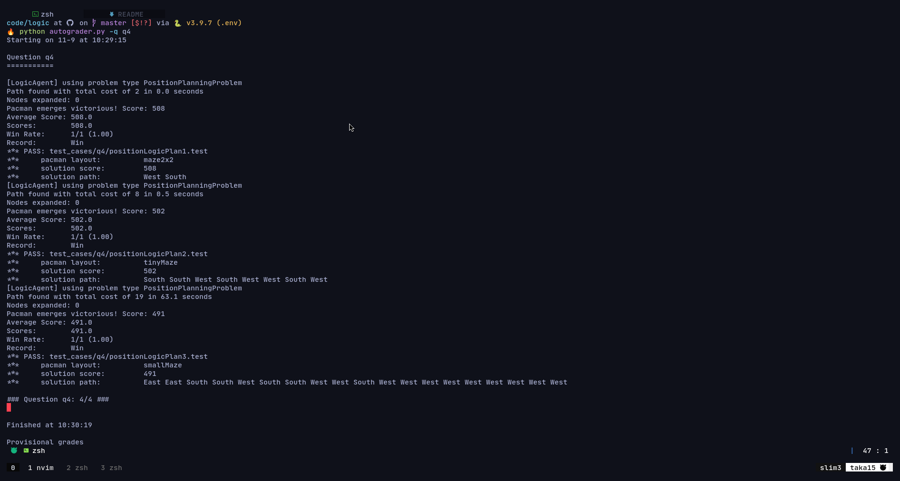
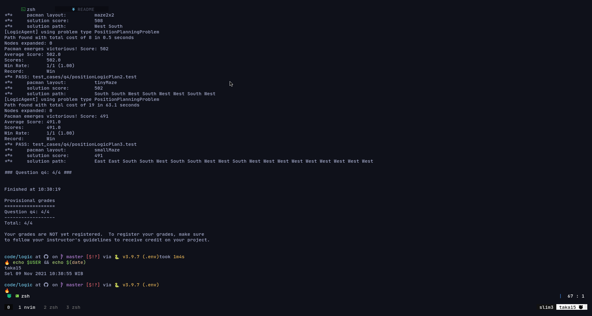
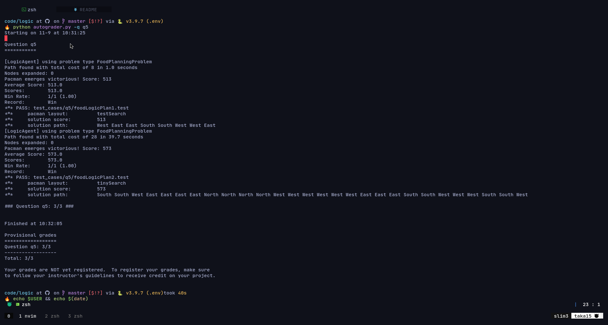
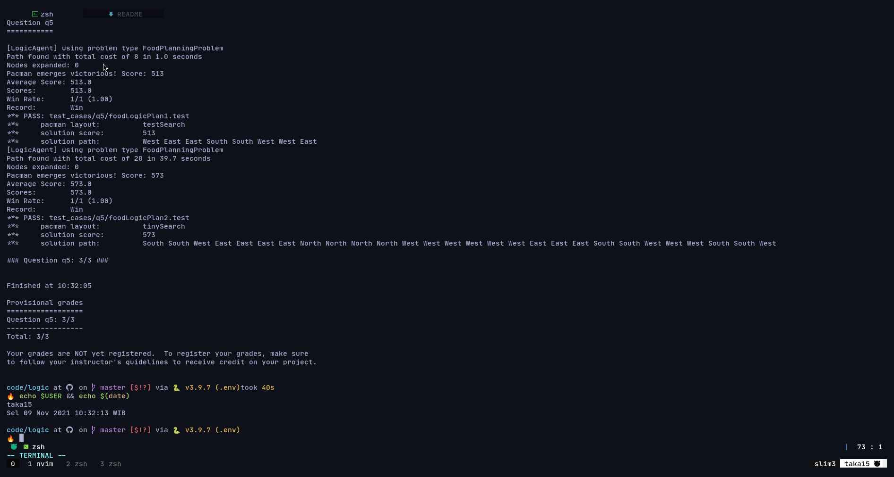

# Project 3: Logic and Classical planning

There's 8 problem, and 4 needed to be solved to reach minimum criteria to achieve
full score. This problems include,

* [x] Q1 (Mandatory)Logic warm-up
* [x] Q2 (Mandatory)Logic Workout
* [x] Q3 (Mandatory)pacphysics and satisfiability
* [x] Q4 (Mandatory)Path planning with logic
* [x] Q5 Eating all the Food
* [ ] Q6 Localization
* [ ] Q7 Mapping
* [ ] Q8 SLAM

> NB: all test's screenshot is stored at screenshot directory

## Q1 Logic Warmup (DONE)

> Difficulty: Easy(3.5/10)

this is a warmup problem given to warmup the propotional logic's concept needed to
finish all problem below, due to the nature of given problem, we may not used traditional
programmical logic like if else and were replaced by Logical expression, this problem
train my mind to understand the concept and how-to implemented it in code languange.

The task on this problem were relatively easy, i just have to translated 3 logical
sentence into a logical expression format. This were done by using Expr() function.
The how-to of this function was explained in [logic.py](./logic.py) and cs188 website
This function were used by inputing the expression Example,

```python
a = Expr('A')
```

This will make a logical expression A, and all logical operators like not(~), and(&),
or(|), ifthen(>>), and others can be implemeted to that expression.
To simplify the use of multi variable AND operator anf OR operator, we can use 2
built-in function from this problem conjoin() for AND , disjoin() for OR. Operator's
priority also can be use with this function such as example,

```python
a = Expr('A')
b = Expr('B')
b = Expr('C')

print(conjoin(disjoin(a, b), c))
```

this code will provide output such as,

((A | B) & C)

the fourth part of this problem required me to convert the expression to [CNF FORMAT](https://en.wikipedia.org/wiki/Conjunctive_normal_form)
this was done by using pyCosat function in Logic.py,

```python
return(pycoSAT(to_cnf(sentences)))
```

### Screenshot q1



## Q2 Logic Workout (DONE)

> Difficulty: Medium(4.5/10)

In this problem, we were given several uncompleted function to perfected our logic
in this problem i work to solve the problem sequentially.

### atLeastOne

In atLeastOne we needed to return an expression where it's true if at least one expression
is true, this Logical Expression needed to be in CNF format, to accomplish this we
can just use OR expression between each expression, since OR expression's property
is overall expression is true if at least one of the expression is true.

### atMostOne

in atMost we needed to return an expression where ovrall expression is true if at
most one of the expression is true, this can be seen in the truth table below,
| A    | B    | Final    |
|---------------- | --------------- | --------------- |
| 1    | 0    | 1    |
| 1    | 1    | 0    |
| 0    | 0    | 1    |
for this problem we needed to make the resulting CNF expression a conjuction of
conjuction of 2 of n clauses, to achive this i used python built-in itertools combination
function to get those conjuction. To satisfied the requirement in the truth table
can used not and operators, but since the format of NAND isn't allowed by the CNF
format, we can use De Morgan law to fix this so from ~(A & B) become (~A or ~B),

```python
list = []
for i in itertools.combinations(literals, 2):
    list.append(disjoin(~i[0], ~i[1]))
return conjoin(list)
```

### exactlyOne

To get exactlyOne, i used both atLeastOne and atMostOne as the component for exactlyOne
logic sentence. since to achieve true on exactly one the expression needed to make
at least one is true and atMostOne is true at the same time, so i conclude we can
conjoin exactlyOne and atMostOne.

### Screenshot q2


## Q3 pacphysics and satisfiability (DONE)

> Difficulty: Medium(5.5/10)

In this problem i just followed the pseudo-code from the cs188 website, in this problem
there are two part needed to be done, pacphysics_axiom and check_location_satisfiability
for pacphysics axiom i just followed the pseudo code while also make some change.
To satisfied the needed condition where pacman choose exactly one of action or location
i used exactlyOne function i already made before.

For check_satisfiability problem the function should return
findmodel method to check wether if within all knowledge base boundaries with model1
or model2 is true or not, model1 is the logical sentence to check wether pacman
reach x1, y1 at timestep 1 and models2 is the contrary of models1. as for the
implementation of the code i heavily use the PropSymbolExpr function, that
function is basically the more advanced version of
Expr function. While Expr function only convert character into a logical  expression
PropSymbolExpr make a Logical Expression with some defining characteristic, if
we want to make Expression about pacman potition we used
PropSymbolExpr(pacman_str, x, y, t), to make an expression for wall location we can
use wall_str and etc.

Both of this problem use concept known as Knowledge Base or KB, it is a concept
where it store all past knowledge of it's logical sentence into one big arrays, so
it can be used for goal assertion or findmodel function

The point is pacphysics and satisfiability problem is a problem that started to implemented
Logical thinking from first two problem into the pacman physics and how does the
Knowledge Base(KB) works.

### Screenshot q3



## Q4 Path planning with Logic (DONE)

> Difficulty: Hard(6.5/10)

In this problem i need to find a way to make a Logical expression to make a pacman
reach Goal position of a Maze. The Hard thing from this problem is to change my prespective
from trying to solve this problem using "the ususal algoritmic" way and use more
a propotional logic approach, but thanks to pseudo-code provided by the documentation
i can managed to finish this problem

To finish this question first i analyzed the pseudo code and write some necessary
code into the function. One thing i confused is how to use findmodel to check necessary
condition to pass the goal assertion, but thank god i managed to finished it, since
the goal assertion were explained in the docs. All the necessary step in Q4 i take
form Q3 core concept including how to take exactly one step action for each timestep

One thing bothers me is after i finish it keeps telling me that, i got illegal action,
this indicates there's something wrong on how the code handle action sequence. at
first i tought there's something wrong with the extractActionSequence function since
it's the function that return action that will be executed, but after i check every
docs from hovering the function i realize somthing was off with the PacmanSuccsessorAxioms
function, since it says that it start from state (t-1), so i changed the input into
the function to t+1 so it cancel the state, and thank god it worked fine.

### Screenshot q4




## Q5 Eating all the food (DONE)

> Difficulty: Hard(8/10)

This is the hardest problem so far in this Project, the premise of the problem
seen from the docs were just it's the same as Q4 but with some caviat, first is food
initialization, whre food is find if and only if there was food. at first i dont
understand what it means an i try to use iff operator (%) but it was fail, but a
friend told me that if each food is true if and only if each food is true meaning
it's true without caviat, no need for iff operator, I incoporated that concept into
the code by looping all food location into KB even befor Timesetep were started.
this helped to mapped where does all the food and incoporated it into the knowledge
base.

The second task is to change the goal assertion into if food were false or been eaten
i'm doing this by looping into all foodloc inside each iteration of timestep so
if a food already eaten it will affect the KB, and i use OR to bind all food state
since the assertion is if all food is already eaten, so to reach assertion false
i need all component be false.

The hardest part is the food successor axiom since we have to find relation between
food[x,y,t], food[x,y,t+1], pacman[x,y,t] to solve this problem i use truth table
to help find the expression, this take a long time to solve but i managed to crack
it and find the logical expression between those 3,

```python
disjoin(conjoin(pacLoc, foodLoc, ~foodLoc1),
        conjoin(pacLoc, ~foodLoc, ~foodLoc1),
        conjoin(~pacLoc, foodLoc, foodLoc1),
        conjoin(~pacLoc, ~foodLoc, ~foodLoc1))
```

> pacLoc = pacman[x,y,t] ; foodLoc = foods[x,y,t]; foodLoc1 = foods[x,y,t+1]

this exprssion were gathered using a method i found in internet that allow me to
convert truth tableu into logic expression quickly. using this expression i succsessfully
finished Q5.

### Screenshot Q5



