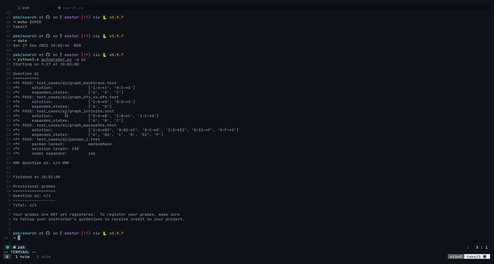
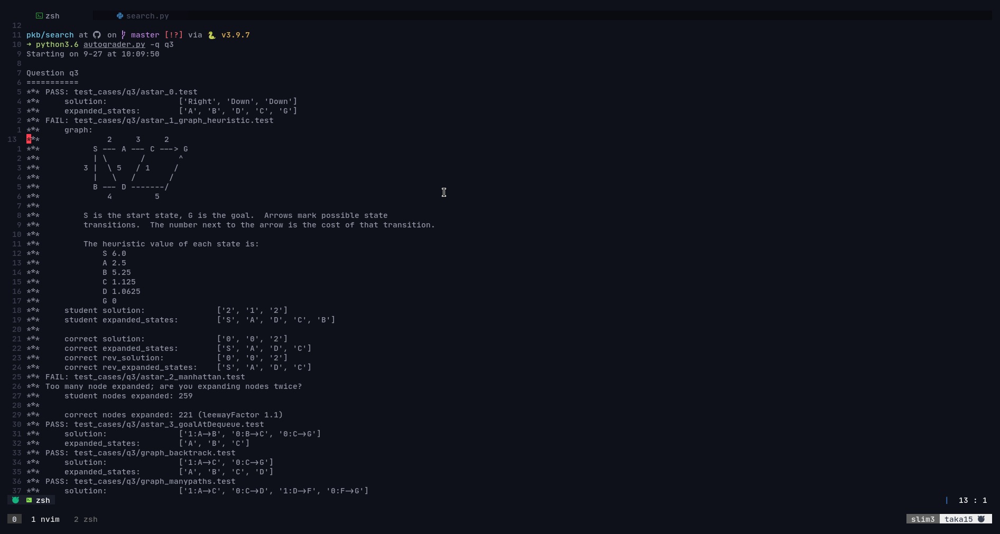
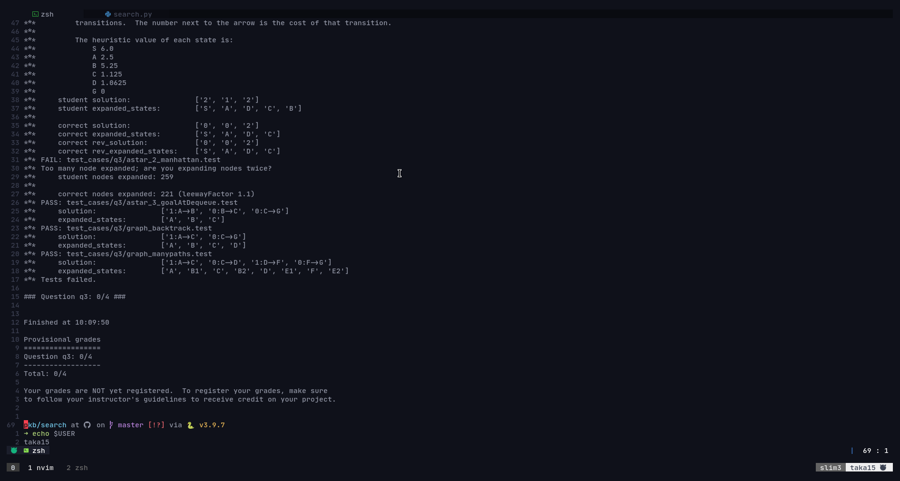
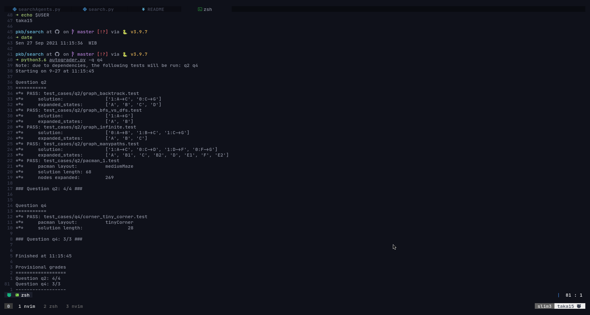

# Project 01 PKB

Terdiri dari 7 question yang akan di review secara mendalam di pembahasan selanjutnya

## Q1 Depth First Search (Status: Done)

> Difficulty : Medium (3/10)

In this problem i make a new class to store all the data about the nodes
(state, action, parent) and use an object from that class as format for nodes
that were pushed to the stack. For the search algorithm i use stack as the data
structure because the Last in First Out concept of it and it will be perfect to used
in depth first search algorithm, because the first data it can poped was the last
data were pushed and it was suited for in depth search of one branch of the tree.

for the backtrack i make a new array to store all the actions step, and each loop
after the agent already reached a goal and there's still a parent nodes on that
agent state, it will reverse the step and added it to the list and finally return
the list. At first i was confused for the Concept of this and didn't know how to
implement the code, but thankfully i found some CS50's videos about Search algorithm
that helped me finish the problem.

### proof of Autograder

## Q2 Breadth First Search (Status: Done)

> Difficulty : Medium (4.5/10)

Basically in Breadth first search i used the same logic as DFS withs some tweaks,
mainly the use of queue as the Data Structure to store the Node's Object and i added
another list for storing frontier nodes, this list was to check wether the expanding
node of the current state was double or not, if it's not in frontier list then it
can be safely added to the frontier node

### proof of Autograder 2

## Q3 A star Search (Status: Done with an exception)

> Difficulty : Hard (6.5/10)

In A star i used different implementation than before, in this problem i make a new
class to to state the node's data with plus the total cost of it's node. The backtracking
algorithm was basically the same than before but the different is how the agent search.
in a star before the search was commence i use conditional to check again wether
the current nodes were in visited or not to prevent double expansion of the node.
after that i  use cost variable to store the current cost of the nodes and fcost
store the cost + heuristic value of the frontier nodes. I used priority Queue to
store the data and use the fcost as the priority parameter.

Honestly i still havent finished all the autograder's problem for this question
but the pacman is up and running and following the a star path.

### proof of Autograder 3

## Q4 Corner's Problem (Status: Done)

> Difficulty : Hard (8/10)

In corner's problem at first i was confused to what to do, but after a long explanation
from my friend i understand how it should works, so what i should edit is not the
search method (because the search method used was BFS) but the Agent's function so
the search function can found the food at all corner.

The first thing i do is to define the corner as a tuple list at the init function.
the next thing i do is to defined the next action of the pacman so it can reach all
corners. I use some of heuristic concept here by taking all the (x,y) coordinates
to defined each state and and the vector to reach next state defined by the action.
I also use conditional with built in function to ceck if there's wall into the action's
direction and how to avoid it. To get the next state of the action i use vector of
the action state and added it to the current state coordinate and also check it again
if it hits the corner or not. if it's hit the corner it will turn using the corners
variable. To count the cost i use the vector i mentioned erlier and added each coordinate
to the actions list, if its hit the wall it will return 9999 so the cost will so
big it will not be considered by the heuristic.

### proof of Autograder 4

