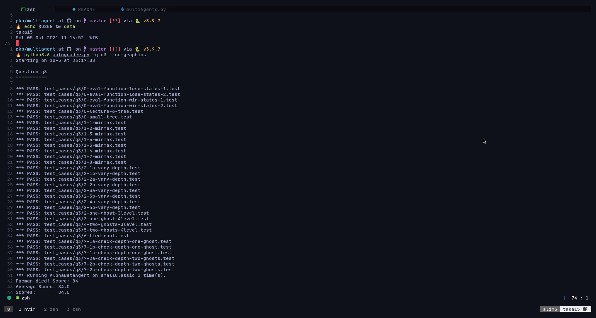

# Project 2 Multiagent

There's 5 Problem needed to be solved which includes,

* Q1 Reflex agent
* Q2 Minimax search
* Q3 Alpha beta Prunig
* Q4 Expectimax
* Q5 Evaluation Function

> **NB:** all test's screenshot is stored at screenshot directory

## Q1 Reflex Agent (DONE)

> Difficulty: Hard (8.5/10)

This problem tell us to make an evaluation function for pacman.
As described by the question this evaluation should be based by the closeness of
pacman to other entity which is ghost and fodd, where when the pacman were close
to food the score should go up(which indicates pacman will head toward this direction)
and if the pacman were to close to the ghost the score should go down (pacman will
avoid), and pacman will move to the position where the score were the highest for
each legal action.

So i tought in order to finish this problem there's some condition that needed
to be satisfied namely,

* if the distance to ghost were close or small score should be reduced
* if the distance to food were close the score should be increase
* if pacman eat power pellet and the gost were scared, pacman should be moving freely
* the distance used were manhattan distance

now with those 4 condition in mind, i started to search the solution. first i tought
to use the minimum distance of both ghost and food as score variable, so at first
i tried to substract food distance from ghost distance so if the ghost distance were
small it's reduce the final number and if food distance were small it's increase
it, It doesn't work. After that i first tried to utilized the built-in score function
(getScore() function) as the base score for my score, first i tried by adding the
base score with score i alrady tried above, after it failed i tried to substract
the base score with (1/distance to ghost) and distance to food

```text
final score = base score - (1/distance to ghost) - distance to food
```

since it's satisfied the condition, but it's still failed. after that i tried many
combination of numbers and operators to calculate the final score and finally after
4 hours of trying i finally found the formula to find the final score,

```text
final_score = base_score - (7/distance_to_ghost+1) - (distance_to_food/3)
```

with the base number for both distance is 1x10^-9 so it's very small
(if there's no ghost or food the final score will be base-7-(1/3))
i also adedd some conditional that make if pacman eat powe pellet and the ghost
are still freeze, distance of the ghost won't be taken into accout for the final
score so the final score will be significally higher. I put this problem into hard
problem category for how much time it takes me to find the perfect combination
of score formula, it was pure luck for me to stumble at that said combination at
the 4 hours time stamp after i started working at this problem.

### Test case screenshot


## Q2 Minimax Search (DONE)

> Difficulty: Hard (9.5/10)

In this part first thing i do is understanding the concept.
I found this [video](https://www.youtube.com/watch?v=l-hh51ncgDI&t=533s) on youtube
the purpose of this function is to make a function to maximize the score of
one agent anf minimize the score of the other agent (maximize for pacman and
minimize for the ghost)
that said video explained the concept really well, for my implementation of
minimax i divided the workflow into 3 function,

* first function as the base function, all init conditional for which of minimizer
  or maximizer to called is stored in here
* the second and third function to perform the minimizer and maximizer function.

in those function i returned a list consist of action and score of each minimizer
and maximizer.

First the first function will check the depth of the tree and if the games is over
or not, if it is already over it will return the static evaluation of the state and
the action (STOP), if it's not it will go to either of two conditional to check if
the agent were pacman or ghost (Pacman's agent index will always be zero and ghost
agent index will incrementaly increase for each iteration). At fisrt i defined the
default action and action for each max and min which is -infinity and infinity, and
stop for both action,  at the start of each function i put a conditional to check
wether the the function already check all agents, it's done by checking the
current Agent's index number and compare it with the total number of the agent
in the game using getNumAgents() function, if the function already reach all agent
indicated by last index number, the agent index will revert to 0 (back to pacman)
and the depth will change (in this function i started from n depth and the function
will move to depth 0), and if the function haven't reached the end of the all agent,
agent index will incrementaly added (go to next agent) and the dept will be the same.

In each function for each legal action available, the new score will be calculated
using it's own function recursively, usually for each depth the function will calculate
pacman (Maximizer) score first then with the agent's index incrementaly added it
will call the base function and it will call the minimizer function to calculate
ghost's score, and after all ghost's score were calculated it will revert back the
agent's index into 0 and in turns it will call the maximizer function to calculate
the score, this will happen recursively until the depth has reached 0 when it will
return the static evaluation score and stop action alltogether. after the recursion
stopped, finally it's time for backtracking, since i started form n-depth and going
to depth 0, to calculate all the score needed to be calculated by backtracking, and
i need to backtrack the action itself, not the score. That's why i returned each
function as a list so i can easily backtrack the action all the way up to the n-depth

```python
return self.minimaxSearch(gameState, agentIndex=0, depth=self.depth)[1]
```

In the minimizer function after it returned the score from the recursive function,
it will check the returned score

```python
new_score = self.minimaxSearch(successor_game_state, next_agent, next_depth)[0]
```

it will check the returned score by comparing it with the default score, and if
the returned score were smaller than the default score, then the new default score
will be that said return score, and the default action also be that said legal action
and if not it will use the previous default score and action. After that the function
will return the default score and action. This flow is also applied at the maximizer
function with the conditional were to check wether the returned function if it were
bigger than the default score.

I work on this problem for about 2 days, 4 hours each day so i work on Q2 for 8 hours
or so

### Test case screenshot 2


## Q3 Alpha-beta pruning (DONE)

> Difficulty: Medium (6/10)

In alpha-beta pruning the first thing i do is to read the concept and
pseudo-code at cs188 website, since the alpha-beta is the modification of
minimax, so i use my minimax function and modified it a bit. In alpha-beta
pruning we have to compare each of the score of both agent with the other's
best score or berst option to the root, this best score is representrd by alpha
and beta components. the alpha and beta variable is basically the same as
default score but in alpha-beta, the conditional of the score is done in inverted
for each function, in the alpha the score were compared to
beta to see if it's bigger than beta variable and in beta it's compared with the
alpha to see if it's smaller than alpha. if the condition were satisfied it will
break the loop and straight returned the score and action. The alpha and beta point
for the next iteration of recursive it will change to the maximum or minimum score
of the score in each function with each alpha and beta. each alpha and beta is passed
into paramater of each those two function. I finished this problem in just half of
an hour

### Test case screenshot 3




## Q4 Expectimax Search (DONE)

> Difficulty: Medium (6.5/10)

As were the question before, Expectimax is also a modification of minimax function,
the main difference is for expectimax the opponent (in this case ghost) is not always
making the optional decicion to reach the root of the tree (depth-0). So the main
modification in this function were in the minimizer or the ghost functionality to
reach root.

I found a video about expectimax logic, in that video it said that in order for the
opponent to make an unoptimal decicion. The decicion making for finding next score
to the root needed to be the average of previous decicion, and i just did that. I
make the next score for the minimizer (I renamed it into expectation) is the averaged
of the current score. I finished this problem in just 45 minutes.

### Test case screenshot 4


## Q5 Better Evaluation Search (DONE)

> Difficulty: Medium (6/10)

In the better evaluation I need to make a new function to evaluate states and return
score so the pacman can make decicion based on that score. I honestly confused in
how to solve this problem, but i remember that my Reflex agent evaluates the distance
the agent (in this case i can say it's a state) and return the evaluation as a score
so i just plainly use my Reflex agent evaluation function and Alhamdulillah it does
work just fine with 6/6 score on the autograder

I guess my reflex agent evaluation function can be used in Q5 because unlike if i
use onditional of the distance, in my function i plainly use the manhattan distance
of each agent anf calculate the final score from it, and i think it can be inferred
as a state. I finished this problem very early, maybe just in 15 minutes.

### Test case screenshot 5


